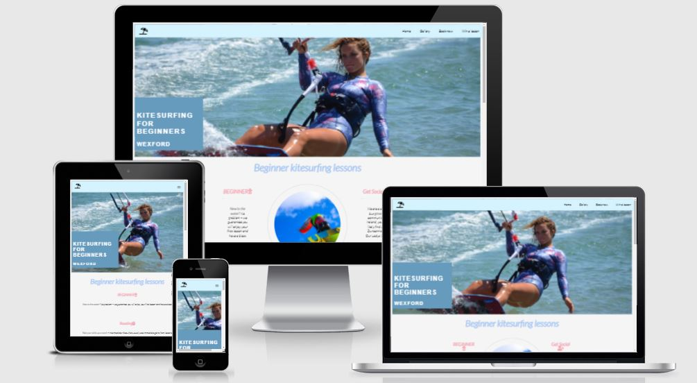
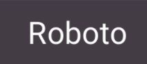
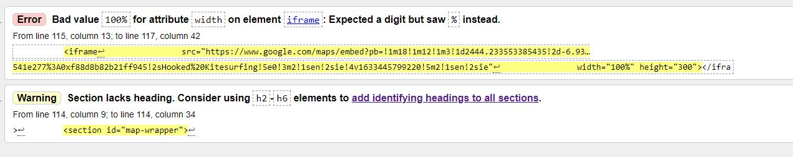

<a href="https://kitesurfingtechie.github.io/Kitesurfing-for-Beginners/">Kitesurfing for beginners Link</a>

GitHub Repository

<h1>Overview</h1>
Kitesurfing for beginners is my Portfolio 1 project.

The site is fully responsive and laid out in a minimal manner to present users with relevant and clear information. The site is generated through html. I was originally given a brief of a project before I started or had the option to come up with my own. I decided to challenge myself and completely come up with an original idea and that is how 'Kitesurfing for beginners' was created. The scope of the project does not
include any back-end functionality, so where a customer completed "Win a lesson" and "Sign-up" form on my page, the information entered into the fields will not feed anywhere. However, the customer will be redirected to a follow-on page on both instances, i.e. Thank you for your booking & Thank you for completing the form with a chance to win a lesson".

<h1>UX</h1>
The primary goal with the sites UX, in terms of UI, was to ensure the design was a simple design, almost minimalist, which helps unclutter and not overload the audience with information and overwhelm them.

From the beginning in the early development stage with planning the wireframes of the website my goal was to have my images as a main focal point. To enforce that from the first interaction, I decided to have a full page image of a Kitesurfer (hero-image), which immediately gives the audience the feel of what the website is all about. The landing page highlights the benefits of Kitesurfing, as well as showing the times  (of which is displayed on other pages also should the user need same, the concept is of repetitive simplicity).

The colours in the hero image are something that I aimed to maintain throughout the site.

<h1>First Time Visitor Goals:</h1>
As a first time visitor I need to able to navigate the site easily and clearly understand how to use the function of the site.
I would like to understand Who, What, Where and When these lessons take place.
I would like to know how to make a booking for a lesson, and i would like that process to be very very clear and simple.
I would also like to understand the benefits of kitesurfing.

<h1>Design:</h1>
Typography
My ambition was to maintain transperancy throughout the customer journey, so I tried to maintain consistency in font and design throughout.
In practicality, the purpose of the site is to drive traffic to the "book now" page. As this is essentially a commerce site. For that reason I decided to highlight the "Book now" tab.

<h1>Logo</h1>

My Headings for all of my pages use a font called 'Roboto''. I chose this font because it is easy to read and it makes it clear that the headings are the introduction to every page.

Any other text that was used throughout the site has a font of 'sans-serif' and I chose this font because it looks very modern and again is easy to read.
paragraphs

<h1>Colour Scheme</h1>
design

The site's primary colours are blue, cream, navy and white. 

The reason for my colour palette was to try and resemble hero imagery. The font color and gallery imagery worked well with this mix of colour. I feel the website has an aqua feel, and is easy on the eye.

These colours are fun and simple.

Layout:
As mentioned earlier, the site is deliberately minimal with what is showcased to provide easy access and navigation. I chose to use images to bring colour and to help break up the text on some of the pages. 

Information about the times/booking for lessons is displayed on a number of pages, as it is one of two primary purpose of the site, the other being to make a booking. It was important that this information was transperant clear and easy to understand.

<h1>Wireframes</h1>
Below will be attached of all my wireframes. These were very basic mockups of how I intended my website to look from the beginning.
 
<section id="Wires">

</section>

--------------------------------------------------------------------------------------------------------------------------------------------
<h1>Pages</h1>

<li><a href="index.html">Home</a></li>
    My Plan was to have one "cool" hero image dominating the page. I chose this image as it is visually appealing, as the kiter looks "in the zone". I want to customer to understand the benefits of kitesurfing (as it is an infant sport in Ireland) and I wanted it to be very clear around times. 
    This page contains buttons which will guide the audience to other places in the site.
    Home Buttons
<li><a href="gallery.html">Gallery</a></li>
    The main purpose of this page is to add a little life to the sport that is difficult to articulate. I chose these particular images as the    were bright, playful and fun. The images are responsive. This page directs you to images of people kitesurfing.
<li><a href="sign-up.html">Book now</a></li>
    Book Now - This page directs customers to booking a lesson. Whilst there is no backend functionalty, the customer will however be redirected to a new html page (booked.html) which will confirm to the user that they have successfully made a booking.
<li><a href="Win-a-free-lesson.html">Win a lesson</a></li>
    Win a Free Lesson - This page directs customers a feedback form, where when completed the customer is in with a chance to winning a free lesson. Whilst there is no backend functionalty, the customer will however be redirected to a new html page (free-lesson.html) which will confirm to the user that they have successfully completed the form.

<h1>Features</h1>
Current Features
Every page is responsive on all devices.

<h1>Footer Socials</h1>

The footer contains 4 social media icons which are completely interactive and will take people to the relevant social accounts where they can contact us directly or review the platforms to understand what our customers are saying.

<h1>Below is everything that I used throughout development which helped with building the website.</h1>

HTML: - HTMl5 provided the content and the structure of my website. I used a few semantic elements where possible.

CSS: - CSS was used to style all my pages.

Google Fonts: - Google fonts was used to import all font types for the different elements.

<a href="fontawesome.com">Font Awesome:</a> Font awesome was used on all pages throughout the website to add icons for aesthetic and UX purposes.

<a href="github.com">Git Hub:</a> GitHub was used to externally hold my repository. Will also use GitHub pages to deploy my website..

<a href="Balsamiq.com">Balsamiq:</a> Balsamiq was used tp create wireframes during the designing process.

<a href="Coolors.com">Coolors:</a> Coolors was used to help design my colour palette for the website.

<a href="Pexels.com">Pexels:</a> Pexels Was used to download images.

LoveRunnning - LMS project features were used.

Mentor - I had a session with my mentor who helped me with coding issues I was facing.

Slack Community - Very helpful in helping me with issues I encountered.

<a href="YouTube.com">YouTube:</a> Helped me with dimension responsiveness.

<a href="W3School.com">W3School:</a> Helped me with booking form and calendar.

<h1>Testing</h1>
Testing was carried out both manually and automatically.

For Manual testing I constantly had a preview of the website and specifically the page I was working on which I would check on regularly and hard reset the browser so any changes to my code would appear. If I found there was an error with my code, especially when first working with media queries, I would use the dev tools to change, alter and add code and make sure it worked smoothly before then adding it to gitpod. I also tested responsiveness both through console tools.

<h1>Reports</h1>

Automatic testing of my HTML and CSS structure were done in W3C Validator to ensure there were no errors in my code and that it was formatted properly. (All of my pages and CSS was run through the validator and none of them show any errors)

HTML validator for index.html

<a href="validator.w3.org">Index HTML Validator</a>

CSS Validator

CSS Validator

Additionally to the above, I had given my Github pages link to various people in order to rigorously test the website, both on mobile and desktop.

<h1>Bugs</h1>
During the testing of the build I discorvered that content wasn't appearing how it was supposed to. I will list a few of the bugs below.

Bug: I had coded it so on mobile screen sizes, the nav bar turned into a dropdown menu, however for some reason it wasn't being implemented when testing the website.

Solution: There was a problem in my code where one of my 'meta' was named viewport instead of description. As a result of that, it overrided the other viewport meta and caused my website to not work.

Bug: My hero image for the index page wouldn't stretch to screen for mobile devices.

Solution: I altered the image to "cover".

Bug: When I tested my site via html checker I got the below two errors intially:

Bug: Warning Header: I do not have anything to say what the map is showing. Was advised by Slack Community to ignore it.

<h1>Deployment</h1>
GitHub Pages
I deployed this site through GitHub pages, as follows:

<ul>
    <li>Log into GitHub</li>
    <li>Go to the repository</li>
    <li>Go to settings</li>
    <li>Scroll down to "GitHub Pages" section</li>
    <li>Select the source (I chose master branch in this instance)</li>
    <li>After some time, the site will be deployed and ready to see.</li>
</ul>Log into GitHub

<h1>Credits</h1>
<ul>
    <li>Thanks to Anthony, my code institute mentor, for his guidance and insight and the constant confidence boost to help me in the right     direction.</li>
    <li>The Slack community. The amount of help and support and encouragement I recieved really helped throughout the project. Particularily Matt Bodden.</li>
    <li>W3Schools for their exceptional explanations and useful examples.</li>
    <li>Coolors - Used to create my colour palette.</li>
    <li>Balsamiq - Used to build wireframes for my website.</li>
    <li>W3C Validator - A validator used to check my HTML and CSS structure and format periodically throughout the build.</li>
</ul>
